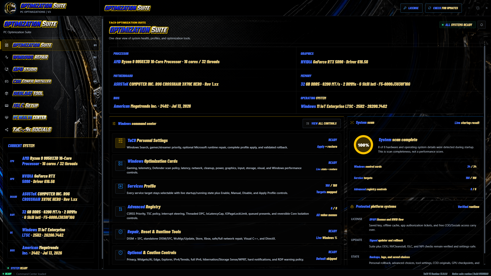
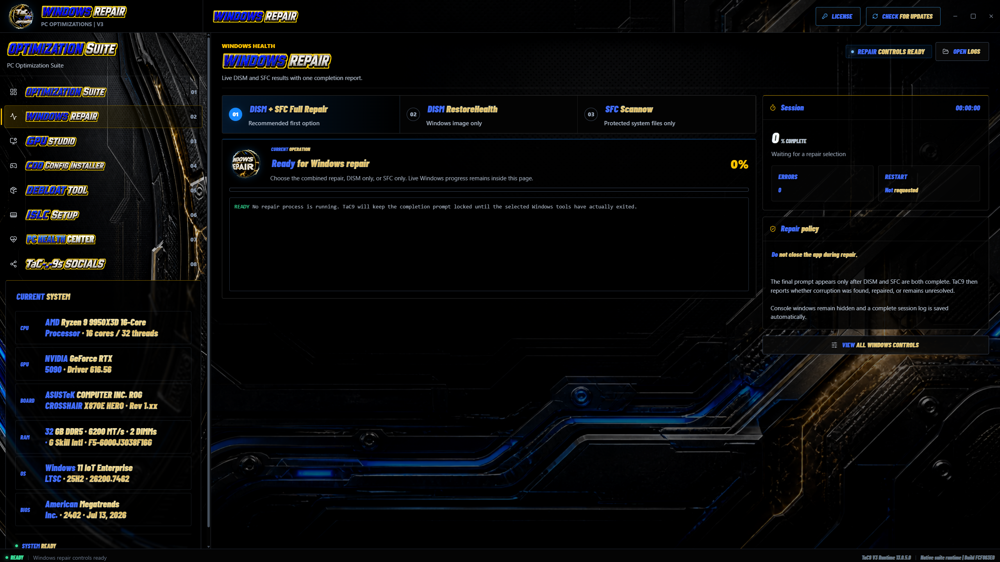
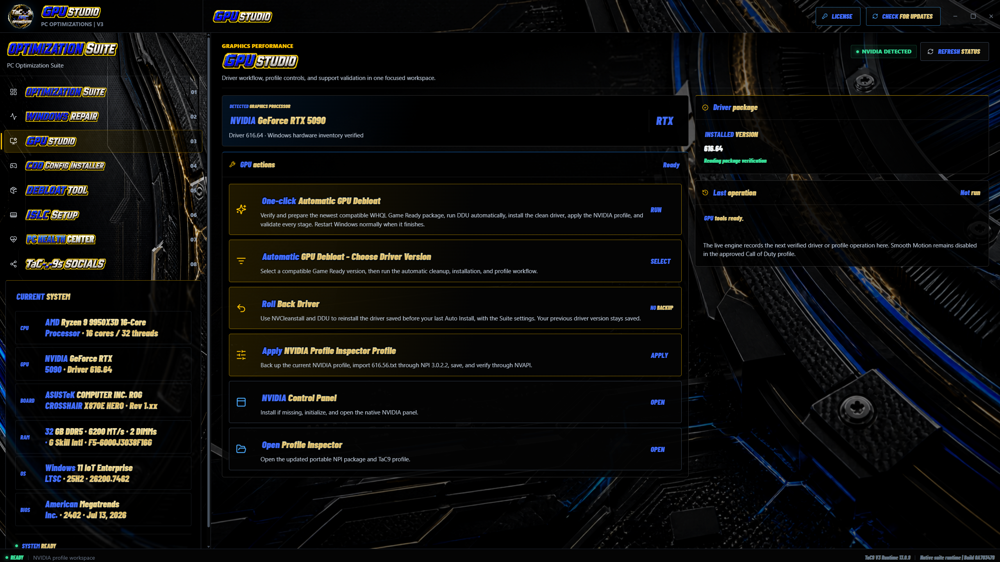
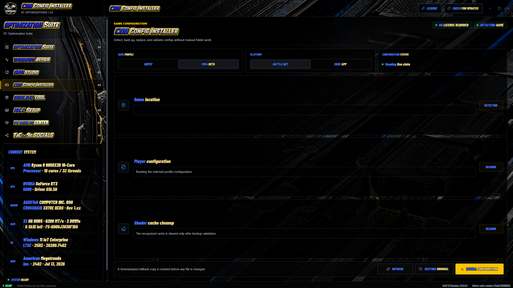
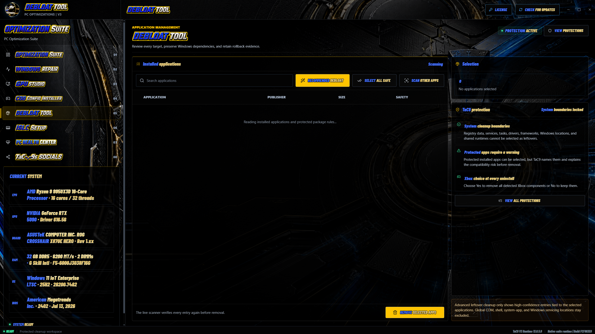
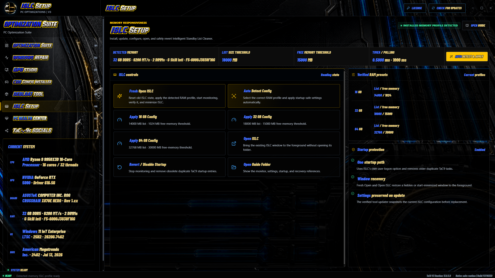
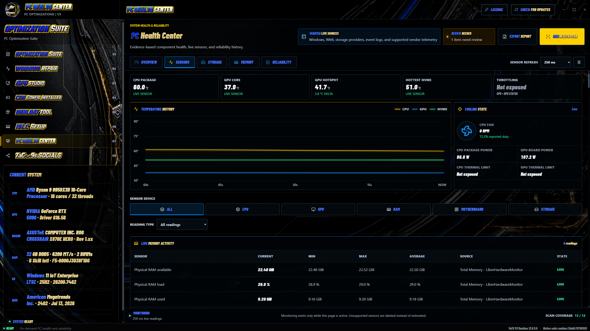
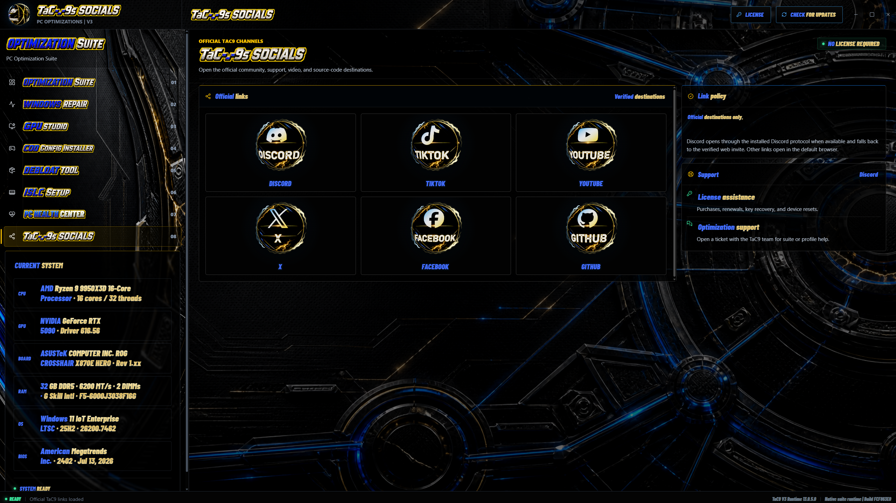

# TaC9 PC Optimization Suite V3

**Windows optimization, repair, NVIDIA driver setup, game configuration, and PC health in one desktop suite.**

TaC9 brings the everyday work of setting up and maintaining a gaming PC into one coordinated Windows interface. Review system information, choose Windows settings, perform a clean NVIDIA driver setup, install the TaC9 Call of Duty configuration, remove unwanted apps, configure ISLC, and investigate hardware or Windows reliability issues without searching through separate tool folders.

**Paid keys are required for protected Suite tools.** Get access through a ticket in the official TaC9 Discord. This repository provides official downloads, documentation, screenshots, and release notes. Protected application source and private access data are not published here.

[Download](#download) | [Included Apps](#included-apps) | [Getting Started](#getting-started) | [Support](#support) | [Release Notes](docs/RELEASE-NOTES.md)



> Screenshots show the packaged V3 13.0.6 interface. Hardware and live sensor values are from the test PC; non-sensor maintenance states use the UI test harness. No driver cleanup, repair, or app removal was performed for these screenshots. Available readings depend on your PC.

## New in V3

- **13.0.9:** Fixed DISM/SFC repair reporting, added a ScanHealth baseline, and made live and final verdicts agree. Unverified or incomplete repairs show a warning.

- **13.0.8:** Removed the automatic NVIDIA Control Panel preview-page step. GPU setup no longer opens Control Panel for it.

- **13.0.7:** Fixed the final monitor-identity checkpoint error, added duplicated-display targets and color read-back checks, and moved scaling-override persistence after the other display changes. Continue retries the unfinished step.

- **13.0.6:** Roll Back Driver reinstalls the saved previous NVIDIA driver through NVCleanstall and DDU. Installs save a small previous-driver record, and the GPU progress window can be closed and reopened. [GPU installation and rollback guide](docs/GPU-ROLLBACK.md).

- A full-screen animated startup with the rotating TaC9 emblem, assembling silver chassis, upgraded blue/gold lighting, and a smoother transition into the suite.
- Larger, clearer text and content-aware scrolling throughout the suite, including the 1080p and scaled-window layout fixes.
- Expanded PC Health Center sensor tables with **Current, Min, Max, Average, Source, and State**, plus device and reading-type filters.
- CPU, GPU, RAM, motherboard, and storage monitoring where supported, including temperatures, voltages, wattages, clocks, utilization, cooling, current, transfer rates, and memory activity.
- CPU-sensor diagnostics with an optional, explicitly confirmed installation of the official signed PawnIO support component when needed.
- **13.0.1:** CPU access-failure detection and read validation, so failed Ryzen register reads are shown as unavailable instead of misleading live clock, VID, or power values. Reports include provider and hardware-access diagnostics.
- A GPU preflight fix for the GPU-Z/HWiNFO `Add` error, corrected status reporting, and no false 100% completion on failed operations.

The eight existing workspaces remain together. The repository keeps its original `TaC9-PC-Optimization-Suite-V2` address so established links and update feeds continue to work; **the current application is V3**.

## Download

**Current release: V3 13.0.9**

**[Download TaC9 V3 for Windows](https://github.com/Tac-9-Pc-Optimizations/TaC9-PC-Optimization-Suite-V2/releases/latest/download/TaC9-PC-Optimization-Suite-V3-r1.exe)**

[All releases and release notes](https://github.com/Tac-9-Pc-Optimizations/TaC9-PC-Optimization-Suite-V2/releases) | [SHA-256 checksum](https://github.com/Tac-9-Pc-Optimizations/TaC9-PC-Optimization-Suite-V2/releases/latest/download/SHA256SUMS-r1.txt)

One complete Windows executable, `TaC9-PC-Optimization-Suite-V3.exe`, includes the suite's eight workspaces. The COD Config Installer is included inside the suite, not offered here as a separate executable. Version 13.0.9 is approximately 191.7 MiB. Blender and Node.js are not required to run the suite.

Existing V2-named download links remain available and run **V3**. Use the download above or **Check for Updates** in the Suite to get the current package. The genuine previous V2 remains available in the [12.2.13 release](https://github.com/Tac-9-Pc-Optimizations/TaC9-PC-Optimization-Suite-V2/releases/tag/v12.2.13).

The X3D Core Tester, CoreCycler, and y-cruncher are not included in this release.

### PowerShell Download

Run this short command in Windows PowerShell 5.1 or PowerShell 7:

```powershell
irm https://raw.githubusercontent.com/Tac-9-Pc-Optimizations/TaC9-PC-Optimization-Suite-V2/main/win.ps1 | iex
```

It runs the [readable download script](win.ps1) from this official repository. The command is unchanged from V2. The script downloads the **latest published suite to your Desktop as `TaC9-PC-Optimization-Suite-V3.exe`**, verifies the signed release manifest and the executable's SHA-256, and reports the saved file location. An existing download is left intact if verification fails; a matching current download is reused.

Only the same-named Desktop executable is replaced after successful verification. Other TaC9 executables, folders, shortcuts, license keys, settings, backups, and logs are not removed or changed. This is a downloader, not an uninstaller for previous TaC9 suites.

The script does **not** launch the app, request administrator access, change execution policy, or disable Windows security protections. The short command executes a downloaded script, so use only this official URL and review [win.ps1](win.ps1) before running it. Download verification is not a Windows Authenticode publisher signature.

<details>
<summary>Manual download of V3 13.0.9 without running a hosted script</summary>

```powershell
$url = 'https://github.com/Tac-9-Pc-Optimizations/TaC9-PC-Optimization-Suite-V2/releases/download/v13.0.9/TaC9-PC-Optimization-Suite-V3-r1.exe'
$file = Join-Path ([Environment]::GetFolderPath('Desktop')) 'TaC9-PC-Optimization-Suite-V3.exe'
Invoke-WebRequest -Uri $url -OutFile $file -UseBasicParsing
if ((Get-FileHash -LiteralPath $file -Algorithm SHA256).Hash -ne '66AA0412F398ADDEAC7241487C94DEA9C50242DD465428BBB7CB0D1830E4D4FE') { throw 'Download checksum mismatch. Do not run this file.' }
Write-Host "Download verified: $file"
```

</details>

Open the downloaded executable when you are ready, then follow [Getting Started](#getting-started) to obtain and save your license key. Administrator permission is required for system-changing actions; downloading the file alone does not require elevation.

## Included Apps

| Workspace | What it does |
| --- | --- |
| [Optimization Suite](#optimization-suite) | System overview, Windows optimization controls, personal settings, service profiles, and selected advanced settings. |
| [Windows Repair](#windows-repair) | Combined DISM + SFC repair, individual repair modes, live progress, and saved results. |
| [GPU Studio](#gpu-studio) | One-click NVIDIA driver cleanup, debloat, newest compatible driver installation, and TaC9 profile setup. |
| [COD Config Installer](#cod-config-installer) | Game- and platform-specific configuration installation, original-file backups, and guarded shader-cache cleanup. |
| [Debloat Tool](#debloat-tool) | Application discovery, reviewed uninstall selections, and constrained app-owned leftover cleanup. |
| [ISLC Setup](#islc-setup) | ISLC installation, detected-memory presets, startup configuration, and monitoring setup. |
| [PC Health Center](#pc-health-center) | Supported live sensors, storage and memory information, Windows reliability evidence, and report export. |
| [TaC9 Socials](#tac9-socials) | Official community, support, and video channels. |

### Optimization Suite

**A central command center for understanding your PC and choosing the Windows changes you actually need.**

The opening dashboard brings processor, graphics, motherboard, memory, BIOS, and operating-system details together with the suite's Windows tools. It provides access to personal settings, optimization cards, service profiles, selected registry controls, repair utilities, and optional changes that require extra care.

- **TaC9 Personal Settings:** apply the supplied settings profile, review the operation, and use its available restore workflow.
- **Windows Optimization Cards:** grouped controls for gaming, privacy and telemetry, power, networking, storage, input, graphics, and Windows behavior, with live state and restore controls where supported.
- **Services Profile:** inspect startup and running state, choose individual services, and apply supported Enable, Manual, Disable, or profile actions.
- **Advanced Registry:** explicit controls for the supported advanced settings rather than unrestricted registry editing.
- **Repair and runtime tools:** access the included Windows repair, reset, and runtime-maintenance workflows.
- **System scan:** shows how much of the expected inventory was detected. A 100% scan means complete inventory, not a benchmark score or a guarantee of perfect hardware.

Optional or caution-marked settings should be reviewed individually. More disabled services or more changes do not automatically mean better performance.

### Windows Repair

**A guided Windows image and system-file repair workspace with the real operation kept visible.**

Choose **DISM + SFC Full Repair** to repair the Windows component image first, then check protected system files. Individual **DISM RestoreHealth** and **SFC Scannow** modes are also available when you only need one part of the workflow.

- Runs DISM before SFC in the combined repair mode and waits for the processes to finish.
- Displays repair progress, elapsed time, session status, and an activity log inside the suite.
- Reports whether Windows found corruption, repaired it, encountered an error, or still needs attention.
- Saves a session log for troubleshooting and keeps the restart decision explicit.

Keep the app open during a repair. Some DISM failures require a matching Windows repair source or further investigation; a repair tool cannot resolve every hardware or Windows problem.



### GPU Studio

**Clean NVIDIA driver installation, version selection, and rollback from one place.**

- **Auto Install:** prepare the newest compatible WHQL Game Ready driver available to the workflow.
- **Choose Driver:** select a supported driver version for the same clean installation process.
- **Roll Back Driver:** reinstall the version saved before your last normal Suite installation.

Normal installations save and verify the installed driver version and GPU identity before cleanup. The Suite prepares the driver with NVCleanstall, runs DDU, installs the clean package, checks NVIDIA Control Panel, and applies the supplied Profile Inspector profile and display settings. After a restart, Continue checks the installed driver and profiles. Monitor settings are applied during installation.

The Suite keeps one small driver record, without copying old settings or driver files. A new normal install replaces it only after the replacement passes verification; rollback and Continue preserve the existing backup. If the driver record or required package cannot be verified, cleanup does not start.

Rollback installs the previous driver with the Suite's settings. It does not restore every old custom setting or a Windows image. You can also apply the supplied profile without reinstalling, open NVIDIA Control Panel, or open Profile Inspector.

**[Read the installation and rollback guide](docs/GPU-ROLLBACK.md)** for the steps, backup behavior, and recovery instructions.

**NVIDIA only.** Save your work and close games first. The display may flicker or briefly go black, and a restart is required for final verification. Hardware compatibility, upstream package availability, and backup validation determine whether the workflow can proceed.



### COD Config Installer

**Install the supplied TaC9 Call of Duty player configuration with game-specific paths and original-file recovery.**

The installer provides separate **BOPS7** and **MW4 Beta** modes with **Battle.net** and **Xbox App** platform selection, plus **Steam** support for BOPS7. It checks the selected installation, shows the player-configuration state, preserves the original matching files, and applies only the configuration intended for that mode.

- Detects and validates the selected game and platform paths before making changes.
- Preserves first-seen originals so installing again does not replace the original backup with an already-modified configuration.
- Supports **Restore Original** for the files managed by the installer.
- Limits shader-cache cleanup to recognized files in the validated selected installation.
- Leaves unrelated player files alone and refuses paths that do not match the selected mode.

Close the game before installing or restoring its configuration. Clearing shader cache may cause shaders to rebuild on the next launch. The tool manages configuration and cache files; it does not provide an anti-cheat bypass, unlock paid content, or modify the game executable. Game updates can change file formats and supported paths.

This workspace is available inside the suite without a TaC9 access key.



### Debloat Tool

**Find unwanted apps, review the selection, and remove them with clear cleanup boundaries.**

The Debloat Tool brings installed-application discovery, recommended selections, **Select All Safe**, additional app scanning, and **Remove Selected Apps** into one workspace. You stay in control of what is selected before the uninstall action runs.

After the ordinary uninstallers finish, TaC9 can scan for high-confidence app-owned leftover files, folders, and shortcuts. Shared or uncertain items are not treated as safe just because their names resemble an app, and selected leftovers are checked again before removal.

- Reviews multiple selected apps together and combines duplicate leftover matches.
- Protects Windows locations, drivers, shared runtimes, Microsoft package data, and TaC9 runtime files from leftover deletion.
- Does not use leftover cleanup to delete registry entries, services, or scheduled tasks.
- Warns about protected applications and explains the potential compatibility impact.
- Presents an explicit Xbox-component choice during the uninstall workflow.

Uninstalling an app can remove local settings or affect software that depends on it. Review every selection, especially launchers, shared services, and applications you use for work.



### ISLC Setup

**Set up Intelligent Standby List Cleaner with the detected memory profile and manageable startup behavior.**

ISLC Setup handles the included ISLC workflow from installation and fresh opening through RAM-specific configuration and monitoring setup. **Auto Detect Config** selects the supported preset for the detected memory amount, while explicit **16 GB**, **32 GB**, and **64 GB** options remain available.

- **Fresh Open ISLC:** reset the previous ISLC state, apply the detected profile, start monitoring, verify the state, and minimize the utility.
- **Auto Detect Config:** apply the supported detected-memory preset and startup settings.
- **RAM presets:** show the list-size and free-memory thresholds used by each included configuration.
- **Open ISLC:** bring its existing window to the foreground, including a previously minimized window.
- **Revert / Disable Startup:** stop monitoring and remove obsolete duplicate TaC9 startup entries.
- **Open Guide Folder:** access the supplied setup and recovery references.

Memory cleanup is workload-dependent and is not a substitute for enough physical RAM. The suite does not promise that an ISLC preset will improve every game or PC.



### PC Health Center

**An evidence-based view of supported hardware readings and Windows reliability history.**

PC Health Center groups **Overview**, **Sensors**, **Storage**, **Memory**, and **Reliability** into one monitoring workspace. It combines the sources available on the current PC, including Windows inventory, supported sensor providers, storage status, and event-log evidence.

- Filter readings by **All, CPU, GPU, RAM, Motherboard, or Storage**, then narrow the reading type.
- Inspect temperature, voltage, power/wattage, clock/effective-clock, utilization, cooling, electrical-current, transfer-rate, RAM-activity, and GPU-memory sections where exposed.
- Compare **Current, Min, Max, and Average** for the monitoring session, with the original provider and availability state alongside each row.
- See measured CPU Vcore when a provider exposes it. Requested per-core VID is kept separate, and memory-controller voltage is not mislabeled as measured DIMM voltage.
- Review a live CPU/GPU temperature trend, memory use, drive information, and supported DIMM temperatures.
- Inspect component findings and their supporting evidence instead of relying on one unexplained score.
- Review recorded WHEA hardware errors, display resets, application faults, and unexpected shutdowns where available.
- Adjust the sensor refresh interval, pause monitoring, run a health scan, and export a report.
- Distinguish reported healthy state, review items, critical findings, and unavailable data.
- Diagnose missing CPU support. If prompted, choose **Set Up CPU Sensors** and confirm installation of the bundled official signed PawnIO component; reopen TaC9 afterward and restart Windows only if requested. It is not installed automatically at startup or by the PowerShell downloader.
- Detect CPU access failures and an installed PawnIO version older than the bundled/tested 2.2.0. Invalid reads do not contaminate session statistics; legitimate zero values remain valid when the underlying read succeeds.

Unsupported sensor channels stay unavailable rather than being invented. A healthy result means no fault was found in the supported sources and selected evidence window; it is not a stress test, a hardware certification, or a guarantee against future failure.

Individual CPU, motherboard, firmware, and driver combinations determine sensor availability. Not every system exposes measured Vcore, per-DIMM voltage/power, every fan, or GPU hotspot. Keep Windows security protections enabled if driver access is blocked, and export a report for support instead of disabling them.



### TaC9 Socials

**The suite's direct route to the TaC9 community, help, and videos.**

Open the official Discord for support and announcements, visit the TaC9 YouTube and TikTok channels for published content, or follow the links to X, Facebook, and the TaC9 GitHub profile. Links open through their configured app or browser destination and do not apply PC settings. This workspace does not require a TaC9 access key.



## Getting Started

1. [Download the full-suite V3 executable](https://github.com/Tac-9-Pc-Optimizations/TaC9-PC-Optimization-Suite-V2/releases/latest/download/TaC9-PC-Optimization-Suite-V3-r1.exe), or use the [PowerShell download](#powershell-download) above. Compare its SHA-256 checksum with the release information.
2. **[Join the official TaC9 Discord](https://discord.gg/3nrUffpVzt) and open a support ticket to request your license key.** The TaC9 team will help you obtain the key for the protected tools.
3. Save your work. Back up important files and create a Windows restore point before making substantial system changes.
4. Launch the suite with administrator rights when required for system operations. The interface uses Microsoft Edge WebView2; the launcher can attempt runtime setup when it is missing.
5. Open **License**, enter the key provided through your Discord ticket, and select **Save & unlock**. Keep your key private; do not post it in a public channel or GitHub issue.
6. Review the detected hardware, choose a workspace, read the operation details, and confirm the intended settings. Keep the suite open until the final result is displayed.

**No key is needed for the Socials tab or its official links.** You can use Socials to reach Discord before activating the protected tools. The COD Config Installer also does not require a license key. If the license dialog appears when the full suite starts, close it to use these key-free workspaces.

### Requirements and Compatibility

- A 64-bit Windows PC. Windows 11 is the primary interface target; individual operations depend on the installed Windows build and available components.
- Administrator access for driver, Windows repair, service, and other system-level operations.
- Internet access for driver or tool downloads, update checks, and online services when used.
- Microsoft WebView2 for the desktop interface.
- A supported NVIDIA GPU for GPU Studio's automated driver workflow.
- A matching installed game and platform for the COD configuration workflow.

The V3 layout has been checked at 1920x1080, 1536x864, 1366x768, and 1280x720. The packaged native host was also checked at 1920x1080, 1536x864, and 1280x720; separate readability checks cover narrower views. Smaller windows use scrolling where needed. This is not certification of every monitor, DPI setting, Windows build, or hardware combination.

### Updates on Startup

Starting with 12.2.13, **every normal launch checks for suite and supported tool updates**. A recent launch no longer skips the online check for four hours.

- **Suite and built-in workspaces:** the existing signed GitHub feed now delivers V3 and updates the complete suite together, including Windows Repair, GPU Studio, COD Config Installer, Debloat Tool, ISLC Setup, PC Health Center, and Socials.
- **Supported tool packages:** the tool updater checks DDU, NVCleanstall, ISLC, and the approved compatible NVIDIA Profile Inspector release. Profile Inspector intentionally follows the approved version, not any untested upstream release. Bundled TaC9 profile changes are delivered with suite releases.
- **Verified installation:** newer suite packages must pass the signed manifest, SHA-256, and internal package checks before the update helper replaces the running suite and restarts it. Tool packages use their existing source and integrity checks. Saved license data and settings are retained.
- **Unavailable sources:** incomplete checks are reported honestly; the installed verified suite can still open, independent tool checks are attempted, and a fresh check runs next launch.

The **Check for Updates** button also runs these checks on demand. When moving from 12.2.12, use that button once to bypass its old four-hour startup cache, or close the suite and use the short PowerShell downloader.

An in-app upgrade replaces the executable at its existing location, so an older `V2.exe` filename may remain even though the app and its version are V3. The current short downloader creates the V3-named Desktop file and leaves differently named old suites alone. Version **13.0.9** is delivered through the existing signed update feed to older Suite builds.

Startup package updates do not run GPU driver removal or installation, Windows repair, app debloating, or game-configuration actions. Those workflows remain actions you choose inside the suite. This is not a general updater for every application installed on Windows.

For maintainers, each newer release must include the full-suite EXE and a matching `manifest-v2.json` signed by the existing trusted update key, and be published as the repository's latest release. A GitHub tag or an EXE uploaded without that signed manifest is not enough for the in-app updater.

### Verify a Download

Open PowerShell in the download folder and run:

```powershell
Get-FileHash -LiteralPath '.\TaC9-PC-Optimization-Suite-V3.exe' -Algorithm SHA256
```

Compare the full value with the checksum supplied for that exact release. A checksum helps detect a mismatched or damaged download; it does not replace publisher verification or a security scan.

This release is **not Authenticode-signed**. TaC9's internal package-integrity checks are separate from a trusted Windows publisher signature. Do not disable Windows security protections to run an unexpected or unverified file.

## Backups, Results, and Limits

TaC9 keeps operation logs and uses the backup, checkpoint, or restore behavior supported by each workflow. COD original-file backups, NVIDIA profile backups, and supported Windows-setting restore actions are not a full-system backup and cannot reverse every possible change.

No fixed FPS increase, latency reduction, stability result, or successful repair is guaranteed. Choose changes for your actual hardware and workload. Keep games closed during configuration changes, do not interrupt driver installation or Windows repair, and review any requested restart.

Third-party utilities and libraries retain their own authorship and terms. The suite coordinates them; it does not claim ownership of Microsoft, NVIDIA, DDU, ISLC, or other third-party software. TaC9 is not affiliated with or endorsed by Microsoft, NVIDIA, or Activision. See [Third-Party Software](docs/THIRD-PARTY.md) and the notices supplied with the relevant components.

## Support

Join the [official TaC9 Discord](https://discord.gg/3nrUffpVzt) and open a support ticket to get your license key, ask an access question, or get help interpreting an operation result. You can also find TaC9 on [YouTube](https://youtube.com/@tac9-fps) and [TikTok](https://www.tiktok.com/@tac._.9).

Include the suite version, Windows build, selected app and action, the exact error, and steps to reproduce it. Before sharing screenshots or logs, remove access keys, HWIDs, account details, personal paths, and other private data. Never post a license file or private key in a public issue.

For security-sensitive reports, see [Security and Privacy](SECURITY.md).
